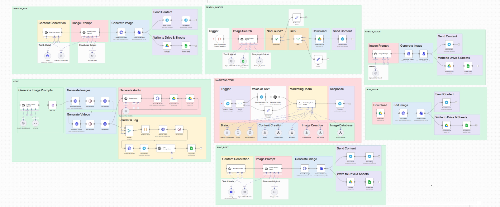
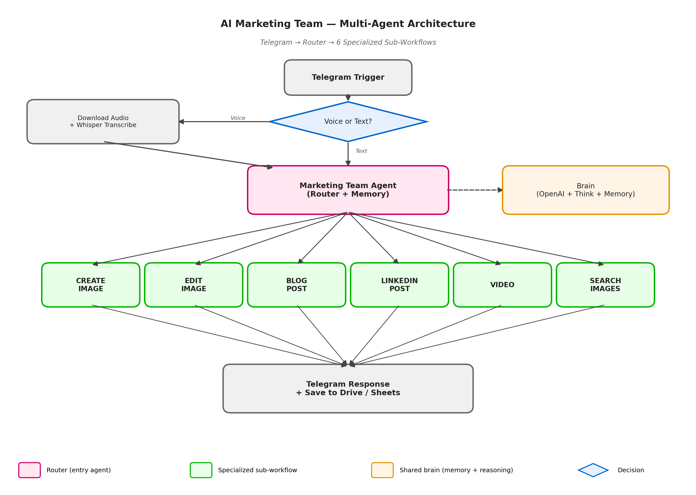

# 🎨 AI Marketing Team Agent

> 📚 **Demo project, currently piloted with a client.** Originally built during an n8n automation course as a multi-agent demo, now adapted to and tested with a solo creator running family workshops (~weekly content cycle).

A multi-tool AI marketing assistant accessible via Telegram. One conversational entry point that routes requests to specialized sub-workflows for image generation, image editing, blog posts, LinkedIn posts, video scripts, and image search. Supports text **and** voice input.

📄 **[Business case study (Polish, Notion) →](https://rich-peace-f2a.notion.site/AI-Marketing-Team-Asystent-marketingowy-dla-solo-creatora-34f9c64536fc819cb1bdee82fcfabbf9?source=copy_link)**

---

## 🏗️ Architecture — Multi-Agent Router with 6 Specialized Sub-Workflows

The workflow is organized around a central **Marketing Team Agent** (the router) that classifies incoming Telegram requests and dispatches them to the appropriate sub-workflow. Each sub-workflow is independent and can be invoked directly via "Execute Workflow" trigger, which keeps responsibilities cleanly separated.

### Sub-workflow breakdown

| Sub-workflow | What it does | Output |
| --- | --- | --- |
| **CREATE_IMAGE** | Image Prompt Agent → DALL-E generation → format conversion | Image to Telegram + Drive + Sheets log |
| **EDIT_IMAGE** | Download existing image → AI edit → save | Edited image to Telegram + Drive + Sheets log |
| **BLOG_POST** | Blog Post Agent (with Tavily research) → image prompt → DALL-E → publish | Full blog post + cover image |
| **LINKEDIN_POST** | LinkedIn-style content generation + accompanying image | Post text + image to Telegram + Drive |
| **VIDEO** | Generate image prompts → batch images → audio → render video | Final video to Telegram + Drive |
| **SEARCH_IMAGES** | Image database lookup → check if found → download or fallback | Image from existing library or Edit fallback |

### Brain layer (shared across all sub-workflows)

The **Brain** sub-agent provides:
- **OpenAI Chat Model** — language understanding and generation
- **Think tool** — multi-step reasoning before action
- **Simple Memory** — multi-turn context across the conversation

This is shared between the router and the specialized agents, so the bot remembers what the user asked 3 turns ago when deciding which sub-workflow to invoke.

---

## 🔑 Key Implementation Details

- **Router pattern over a monolithic agent.** Instead of one giant prompt with all capabilities, each capability is a dedicated sub-workflow with its own agent, prompt, and tools. Easier to debug, easier to extend (adding a 7th capability = new sub-workflow, no changes to existing ones).
- **Voice input as a transparent layer.** The router doesn't know whether the input was text or voice — voice messages are transcribed via Whisper *before* hitting the router, so all downstream logic stays unified.
- **Tavily research tool inside Blog Post Agent.** Blog posts pull current information from the web before drafting, so content isn't limited to the LLM's training cutoff.
- **Search-then-create fallback for images.** SEARCH_IMAGES first checks an existing image database (Sheets-based lookup); if nothing matches, the workflow falls back to image editing instead of always paying for new generation.
- **Drive + Sheets logging on every output.** Every generated piece of content is saved to Drive (the asset) and logged to Sheets (the record), so the user has an asset library and an activity log without any extra effort.
- **Voice-friendly UX.** The user can record a voice message on Telegram while walking ("napisz mi blog post o letnich warsztatach dla dzieci, zrób też obrazek") and get back the full output without typing.

---

## ✨ Features

| Feature | Detail |
| --- | --- |
| 🖼️ **Image generation** | DALL-E via dedicated Image Prompt Agent — generates an optimized prompt before calling the model |
| ✏️ **Image editing** | Modify existing images with natural-language instructions |
| 📝 **Blog post writing** | Full article with web research (Tavily) + auto-generated cover image |
| 💼 **LinkedIn post creation** | Professional post text + matching image |
| 🎬 **Video script & generation** | Multi-step pipeline: prompts → images → audio → video render |
| 🔍 **Image search** | Look up existing image library before generating new ones (cost-saving) |
| 🎙️ **Voice input** | Record on Telegram → Whisper transcription → same routing logic |
| 🧠 **Conversation memory** | Multi-turn context retained across messages |

---

## 🔧 Tech Stack

| Technology | Role |
| --- | --- |
| **n8n** | Orchestration — main workflow + 6 sub-workflows |
| **OpenAI GPT-4o** | Language model for router and content agents |
| **DALL-E** | Image generation |
| **Whisper** | Voice → text transcription |
| **Tavily** | Web research tool inside Blog Post Agent |
| **Telegram Bot API** | User interface (text + voice messages) |
| **Google Drive** | Asset storage (images, videos, posts) |
| **Google Sheets** | Activity log (what was generated, when) |

---

## 🚀 Potential Extensions

- **Scheduled publishing** — auto-post to LinkedIn / Facebook / Instagram via their APIs instead of just generating
- **Brand voice guardrails** — system prompt with tone-of-voice rules per client (e.g., "always mention safety for kids' workshops")
- **Asset reuse** — vector embeddings on existing images so SEARCH_IMAGES finds semantic matches, not just keyword
- **A/B variants** — generate 3 versions of each post, log engagement, learn over time
- **Multi-tenant adaptation** — same architecture, different brand voice + asset library = new client setup

---

## 🎓 What This Project Demonstrates

- **Multi-agent architecture** with router pattern and specialized sub-workflows
- **Hybrid input modalities** — text and voice unified through transcription pre-processing
- **Tool-augmented LLM agents** — Tavily for research, image search before generation, Drive+Sheets for persistence
- **Real client adaptation** — taking a course-built demo and adapting it to a real solo-creator workflow
- **Clean separation of concerns** — each capability is a self-contained sub-workflow, not a tangle of conditionals

---

> Workflow JSON is not public (currently in client testing). Available for review during interview.

📄 **[Business case study (Polish, Notion) →](https://rich-peace-f2a.notion.site/AI-Marketing-Team-Asystent-marketingowy-dla-solo-creatora-34f9c64536fc819cb1bdee82fcfabbf9?source=copy_link)**

---

**Author:** [Tatiana Golińska](https://github.com/TatianaG-ka/) · 📧 tatiana.golinska@gmail.com · [LinkedIn](https://www.linkedin.com/in/tetiana-golinska/)
