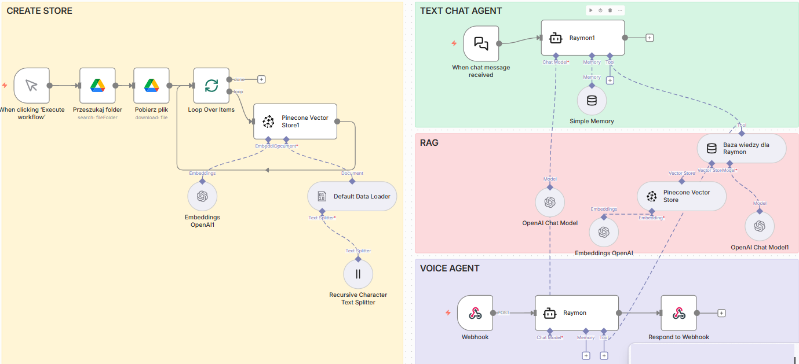
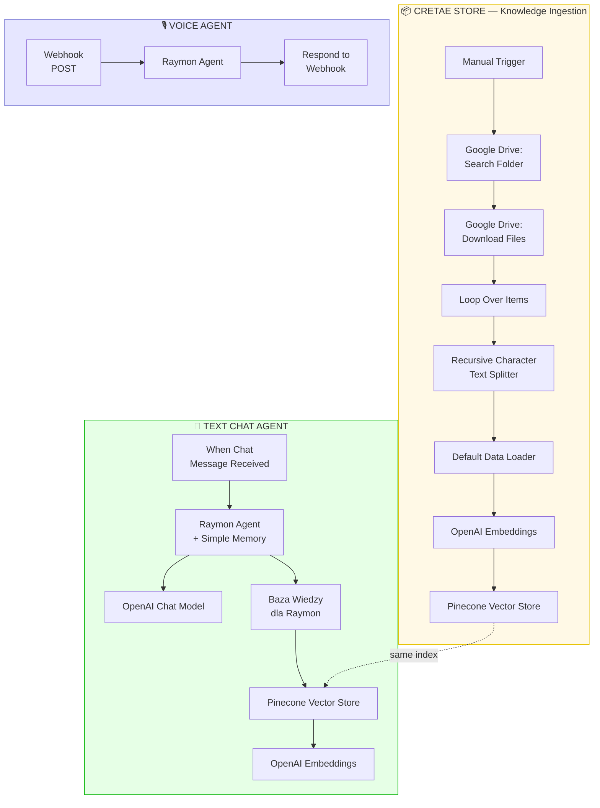
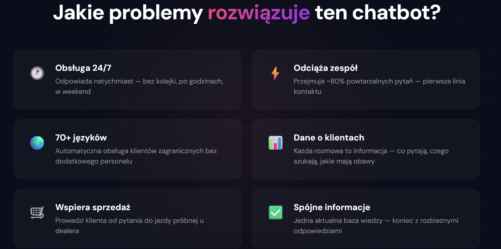

# 🌍 Multilingual AI Customer Support 

> 📚 **Learning Project** — Built during n8n + AI automation course. Demonstrates end-to-end chatbot delivery: data ingestion, text chat agent, and voice agent in a single n8n workflow.
>
> 📚 **Projekt edukacyjny** — Zbudowany podczas kursu n8n + AI. Demonstruje pełne wdrożenie chatbota: ingestia danych, agent tekstowy i agent głosowy w jednym workflow n8n.

**A multilingual AI customer support system for Raymon Bicycles (German e-bike brand) with two interaction modes — text chat and voice calls. Automatically detects the customer's language and responds accordingly. Deployed on a live website.**

---

## 🏗️ Architecture — Three Components in One Workflow

### 1. 📦 Data Base — Knowledge Ingestion Pipeline
Automatically downloads documents from Google Drive, splits them into chunks using Recursive Character Text Splitter, generates embeddings via OpenAI, and stores them in Pinecone vector database. The chatbot never hallucates — it answers exclusively from this verified data.

### 2. 💬 Text Chat Agent
Receives customer messages from the website chat widget, searches the Pinecone knowledge base for relevant information, and generates contextual responses via OpenAI. Includes Simple Memory for multi-turn conversation context.

### 3. 🎙️ Voice Agent
Handles voice calls via ElevenLabs webhook integration. Same Raymon agent, same knowledge base — but the customer speaks instead of types. ElevenLabs handles speech-to-text and text-to-speech, n8n handles the logic.

---

## ✨ What This System Can Do

### 🎯 Product Advisory
Recommends specific bike models based on customer needs — riding style, terrain, budget. Compares motor variants, provides torque, battery range, and explains differences step by step.

### 🌍 Automatic Language Detection
Detects the customer's language and responds in the same one. Supports 70+ languages via ElevenLabs v3. Demonstrated in Polish, German, and English. Switches mid-conversation if the customer changes language.

### 📍 Dealer Locator
Returns dealer name, address, phone number, opening hours, test ride availability — all from the knowledge base.

### 🛡️ Warranty & Service Info
Explains Raymon CarePlus program: lifetime frame warranty, 3-year motor & battery coverage, registration requirements.

### 🎙️ Dual Interaction Mode
Same knowledge, two channels: **text chat** for customers who prefer typing, **voice call** for those who prefer speaking. Both powered by the same n8n workflow.

### 🔄 Smart Escalation
When the bot can't answer, it doesn't make things up — it redirects to the right channel: website, phone, or dealer.

---

## 💼 Business Problems It Solves

| Problem | How the chatbot solves it |
|---------|--------------------------|
| Customers ask questions outside business hours | Responds 24/7 — instantly, no queue |
| Support team wastes time on repetitive questions | Handles first-line contact, automating ~80% of typical queries |
| Customer leaves without a fast answer | Immediate, substantive response shortens the path to decision |
| No data on what customers actually need | Every conversation is a data source — questions, searches, concerns |
| Inconsistent information from different team members | One up-to-date knowledge base, consistent answers |
| No support for international customers | Automatic multi-language support (70+ languages) without additional staff |

---

## 🔧 Tech Stack

| Technology | Role |
|-----------|------|
| **n8n** | Orchestration — workflow connecting all components |
| **OpenAI GPT** | Language engine — understanding questions, generating responses |
| **OpenAI Embeddings** | Text → vector conversion for semantic search |
| **Pinecone** | Vector database — storing and searching product knowledge |
| **ElevenLabs v3** | Voice AI — conversational widget, STT, TTS, 70+ languages |
| **Google Drive** | Source of knowledge base documents |
| **Webhook** | Voice agent communication endpoint |
| **Netlify** | Live website hosting |

---

## 🚀 Potential Extensions

- **Post-sale support** — service requests, warranty claims, ticket creation
- **Lead qualification** — collecting budget, preferences, contact info before handoff to sales
- **CRM & calendar integration** — auto-creating contacts, scheduling, confirmations
- **Analytics dashboard** — most-asked questions, popular products, customer concerns

---

# 🇵🇱 Wersja polska

## 🌍 Wielojęzyczna Obsługa Klienta AI — Raymon Bicycles

**Wielojęzyczny system obsługi klienta AI dla Raymon Bicycles z dwoma trybami interakcji — czat tekstowy i rozmowy głosowe. Automatycznie rozpoznaje język klienta. Wdrożony na żywej stronie.**

### Architektura — Trzy komponenty w jednym workflow

**1. 📦 Baza danych (Data Base)** — Automatyczne pobieranie dokumentów z Google Drive, dzielenie na fragmenty, generowanie embeddingów, zapis do Pinecone. Chatbot nigdy nie zmyśla.

**2. 💬 Agent tekstowy (Text Chat Agent)** — Przyjmuje wiadomości z czatu, przeszukuje bazę wiedzy w Pinecone, generuje odpowiedź przez OpenAI. Z pamięcią rozmowy.

**3. 🎙️ Agent głosowy (Voice Agent)** — Obsługuje rozmowy głosowe przez webhook ElevenLabs. Ten sam agent, ta sama baza wiedzy — ale klient mówi zamiast pisać.

### Co potrafi ten system

| Funkcja | Opis |
|---------|------|
| 🎯 **Doradztwo produktowe** | Rekomenduje modele, porównuje silniki Bosch vs Yamaha, podaje parametry |
| 🌍 **Auto-detekcja języka** | 70+ języków przez ElevenLabs v3 — przełącza się w trakcie rozmowy |
| 📍 **Wyszukiwanie dealerów** | Nazwa, adres, telefon, godziny, jazdy próbne |
| 🛡️ **Gwarancja i serwis** | Raymon CarePlus, zakresy, rejestracja |
| 🎙️ **Dwa tryby** | Czat tekstowy + rozmowy głosowe — ten sam workflow |
| 🔄 **Inteligentna eskalacja** | Nie zmyśla — kieruje do odpowiedniego kanału |

### Jakie problemy biznesowe rozwiązuje

| Problem | Jak rozwiązuje |
|---------|---------------|
| Klienci pytają po godzinach | Odpowiada 24/7 |
| Zespół traci czas na powtarzalne pytania | Automatyzuje ~80% typowych zapytań |
| Klient rezygnuje bez szybkiej odpowiedzi | Natychmiastowa, merytoryczna odpowiedź |
| Brak danych o potrzebach klientów | Każda rozmowa = dane |
| Niespójne informacje | Jedna aktualna baza wiedzy |
| Brak obsługi zagranicznych klientów | 70+ języków automatycznie |
