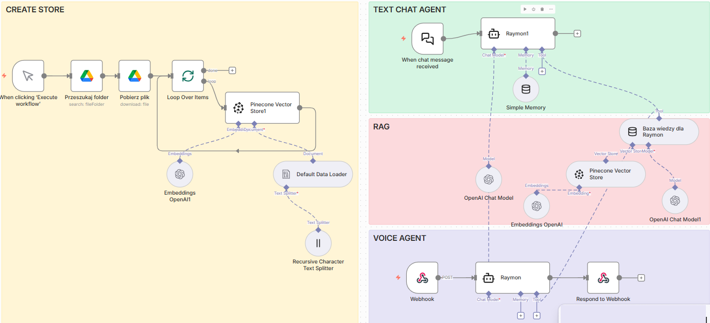
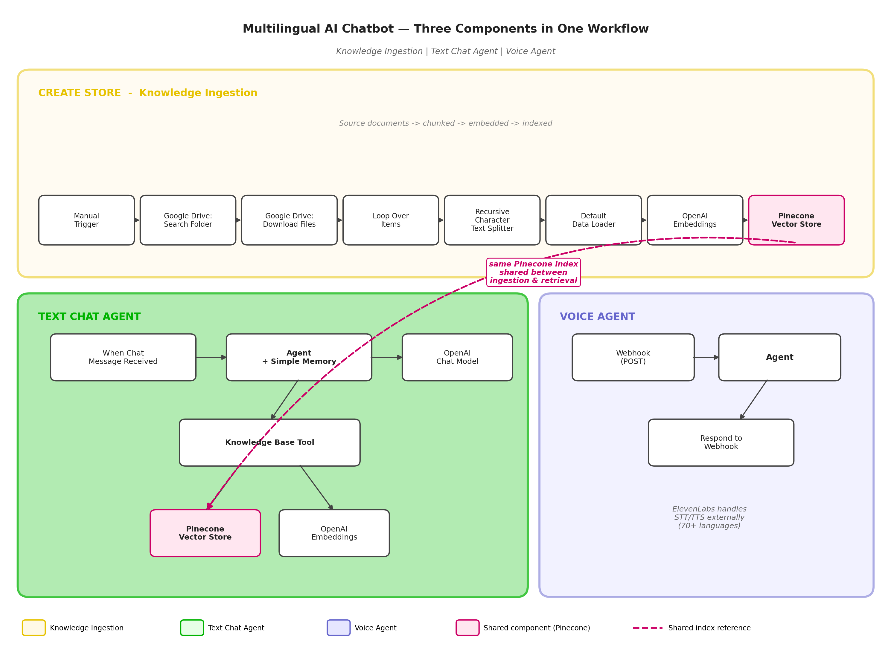

# 🌍 Multilingual AI Customer Support — Demo Project

> 📚 **Demo project — not deployed for any client.** Built end-to-end by me as a portfolio piece: knowledge base, n8n workflow, demo website, and live deployment to Netlify. The e-bike content is inspired by publicly available information about Raymon Bicycles (a German e-bike brand) used as a realistic industry example — this is not a project for that brand.

A multilingual AI customer support chatbot demonstrating end-to-end RAG architecture with text and voice channels. Auto-detects the customer's language and responds in the same one — Polish, German, English, or any of 70+ supported languages. Built as a portfolio piece to showcase: knowledge ingestion, RAG retrieval, dual-channel agent (text + voice), and live web deployment.

📄 **[Business case study (Polish, Notion) →](WSTAW_LINK_DO_NOTION)**

🎬 *Demo video available on request.*

---

## 🏗️ Architecture — Three Components in One Workflow

### 1. 📦 Knowledge Ingestion Pipeline

Automatically downloads documents from Google Drive (e-bike product specs, dealer locations, warranty terms — all based on publicly available information used as realistic demo content), splits them into chunks using `Recursive Character Text Splitter`, generates embeddings via OpenAI, and stores them in Pinecone. The chatbot answers exclusively from this verified data — no hallucinations.

**Why this matters technically:** the same Pinecone index is shared between text and voice agents, so updating the knowledge base in one place propagates to both interaction modes automatically.

### 2. 💬 Text Chat Agent

Receives messages from the demo website chat widget, performs semantic search against the Pinecone knowledge base, and generates contextual responses via OpenAI. Includes Simple Memory for multi-turn conversation context (the bot remembers what was asked 3 turns ago).

### 3. 🎙️ Voice Agent

Handles voice calls via ElevenLabs webhook integration. Same agent logic, same knowledge base — but the user speaks instead of types. ElevenLabs handles speech-to-text and text-to-speech in 70+ languages; n8n handles the agent logic and RAG retrieval.

---

## 🔑 Key Implementation Details

- **Single source of truth for knowledge.** Both text and voice agents query the same Pinecone index — adding a new product spec or location entry to Google Drive updates both channels after a single re-ingestion run.
- **Language detection delegated to the LLM, not a separate step.** Instead of running language detection → translation → response, the system prompt instructs the LLM to detect and respond in the user's language directly. Simpler pipeline, no translation drift, supports any language the LLM understands.
- **Voice via webhook, not a custom transport layer.** ElevenLabs sends transcribed text to an n8n webhook; n8n returns text, ElevenLabs synthesizes voice. Keeps the n8n workflow agnostic of audio handling.
- **RAG with `Recursive Character Text Splitter`** preserves semantic boundaries (sentences, paragraphs) better than fixed-size chunking — important for product specs where a torque value and its motor variant must stay together.
- **Anti-hallucination by design.** The agent prompt explicitly instructs: if the answer isn't in the knowledge base, redirect the user to a human channel instead of guessing.

---

## ✨ Capabilities Demonstrated

| Capability | Implementation |
| --- | --- |
| 🎯 **Product advisory** | Recommends bike models based on riding style, terrain, budget. Compares motor variants, torque, battery range. |
| 🌍 **Auto language detection** | 70+ languages via ElevenLabs v3 + LLM-driven detection. Demonstrated in PL/DE/EN. Switches mid-conversation if the user changes language. |
| 📍 **Location lookup** | Returns dealer name, address, phone, opening hours, test ride availability — all from the knowledge base. |
| 🛡️ **Warranty & service info** | Explains warranty programs (e.g., lifetime frame coverage, 3-year motor & battery), registration requirements. |
| 🎙️ **Dual interaction mode** | Same knowledge, two channels — text chat for typing users, voice call for speaking ones. |
| 🔄 **Smart escalation** | When the bot can't answer from the knowledge base, it redirects to a human channel instead of fabricating an answer. |

---

## 🔧 Tech Stack

| Technology | Role |
| --- | --- |
| **n8n** | Orchestration — workflow connecting all components |
| **OpenAI GPT** | Language engine — understanding questions, generating responses |
| **OpenAI Embeddings** | Text → vector conversion for semantic search |
| **Pinecone** | Vector database — storing and searching knowledge base |
| **ElevenLabs v3** | Voice AI — conversational widget, STT, TTS, 70+ languages |
| **Google Drive** | Source of knowledge base documents |
| **Webhook** | Voice agent communication endpoint |
| **Netlify** | Demo website hosting |

---

## 🚀 Adaptation Path (How a Real Client Engagement Would Look)

This demo is built to be cleanly adaptable to a real client. The replacement plan would be:

- **Knowledge base** — swap out the demo content (publicly available e-bike specs) for the client's actual product documentation in Google Drive
- **System prompt** — adjust tone of voice, brand-specific rules, escalation channels
- **Pinecone index** — fresh index per client; same workflow logic, no code changes
- **Frontend embed** — replace the demo Netlify site with embed code for the client's existing website
- **Optional extensions** — CRM integration (lead capture), order tracking, ticket creation, analytics dashboard

---

## 🎓 What This Project Demonstrates

- **End-to-end RAG architecture** in n8n — from ingestion through retrieval to response generation
- **Multi-channel AI deployment** — same knowledge base serving text and voice channels via a single workflow
- **Practical anti-hallucination patterns** — RAG + explicit prompt-level fallbacks
- **Full-stack ownership** — workflow, knowledge base, demo website, and deployment built by me end-to-end
- **Industry-realistic knowledge base** — not a toy "ask me about cats" bot, but a real-feeling product support scenario

---

📄 **[Business case study (Polish, Notion) →](WSTAW_LINK_DO_NOTION)**

🎬 *Demo video available on request.*

---

**Author:** [Tatiana Golińska](https://github.com/TatianaG-ka/) · 📧 tatiana.golinska@gmail.com · [LinkedIn](https://www.linkedin.com/in/tetiana-golinska/)
