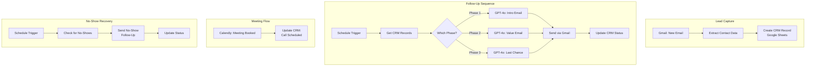

# 📧 Sales Automation Pipeline

> 📚 **Learning Project** — Built during n8n automation course. Demonstrates working knowledge of the integration patterns used in my [client projects](../README.md#-client-projects-in-testing-production-deployment-planned-q1-2026).
>
> 📚 **Projekt edukacyjny** — Zbudowany podczas kursu automatyzacji n8n. Demonstruje praktyczną znajomość wzorców integracyjnych używanych w moich [projektach klienckich](../README_PL.md#-projekty-klienckie-w-fazie-testów-wdrożenie-produkcyjne-planowane-q1-2026).

**A complete, multi-stage sales automation system that processes inbound leads from email, manages them in a CRM (Google Sheets), sends personalized AI-generated follow-up sequences, handles meeting scheduling via Calendly, and automatically manages no-shows — all without manual intervention.**

---

## ✨ Features

- **Inbound lead capture** — Monitors Gmail for new leads, extracts contact data
- **CRM management** — Automatic creation and updates of lead records in Google Sheets
- **3-stage AI follow-up sequence** — Personalized emails generated by GPT-4o at each stage
- **Smart scheduling** — Follow-up timing with wait periods between stages
- **Calendly integration** — Detects when a lead books a meeting, updates CRM status
- **No-show handling** — Automatic detection and follow-up for missed meetings
- **Full audit trail** — Every action logged in CRM with timestamps and status

## 🔧 How It Works

### Four independent sub-workflows:
1. **Lead Capture** — Gmail trigger → contact extraction → CRM record creation
2. **Follow-Up Engine** — Scheduled trigger → phase detection → AI email generation → send → CRM update
3. **Meeting Tracker** — Calendly webhook → CRM status update
4. **No-Show Recovery** — Scheduled check → no-show detection → recovery email → status update

---

# 🇵🇱 Wersja polska

## 📧 Pipeline Automatyzacji Sprzedaży

**Kompletny, wieloetapowy system automatyzacji sprzedaży: przetwarzanie leadów z emaili, zarządzanie w CRM (Google Sheets), spersonalizowane sekwencje follow-up generowane przez AI, planowanie spotkań przez Calendly i automatyczna obsługa nieobecności.**

### Funkcje
- **Przechwytywanie leadów** — Monitoruje Gmail, wyodrębnia dane kontaktowe
- **Zarządzanie CRM** — Automatyczne tworzenie i aktualizacja rekordów w Google Sheets
- **3-etapowa sekwencja follow-up** — Spersonalizowane maile generowane przez GPT-4o na każdym etapie
- **Inteligentne planowanie** — Okresy oczekiwania między etapami
- **Integracja Calendly** — Wykrywa umówienie spotkania, aktualizuje status CRM
- **Obsługa nieobecności** — Automatyczne wykrywanie i follow-up po nieodbyciu spotkania
- **Pełny audit trail** — Każda akcja logowana w CRM z timestampami

### Cztery niezależne pod-workflow
1. **Przechwytywanie leadów** — Gmail trigger → ekstrakcja kontaktu → rekord w CRM
2. **Silnik follow-up** — Trigger czasowy → detekcja fazy → generowanie maila przez AI → wysyłka → aktualizacja CRM
3. **Śledzenie spotkań** — Webhook Calendly → aktualizacja statusu CRM
4. **Odzyskiwanie no-show** — Sprawdzanie wg harmonogramu → detekcja no-show → mail recovery → aktualizacja statusu

