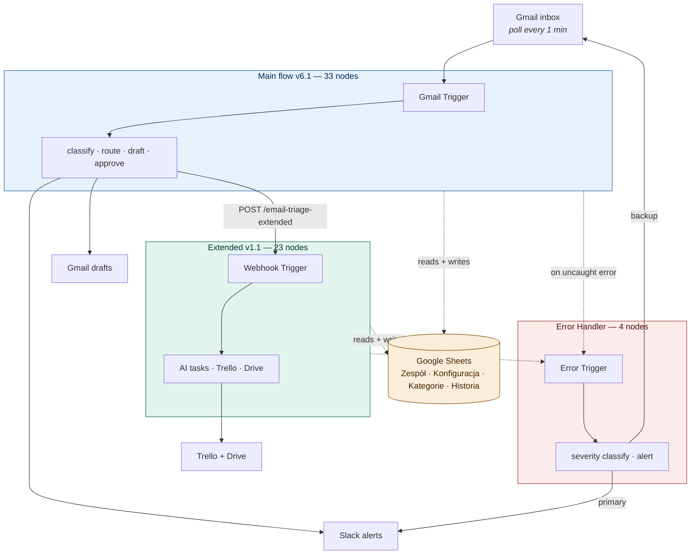
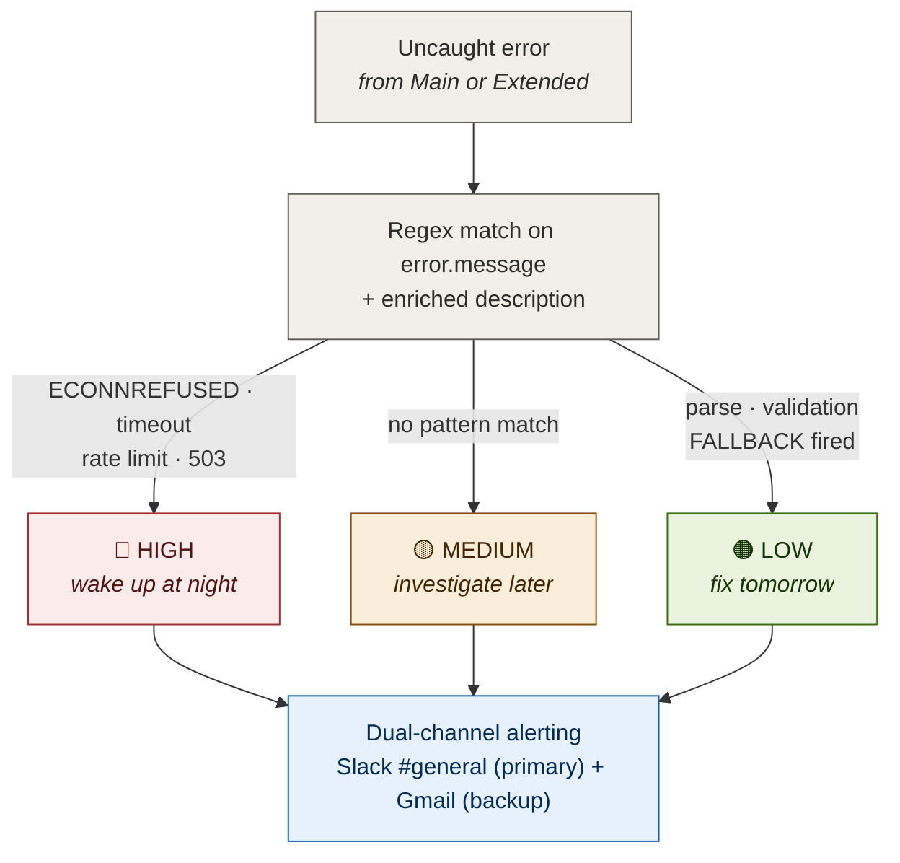

# Email Triage System

Production n8n workflows demonstrating AI integration patterns, defensive engineering, and config-as-data architecture.

> **Featured project:** Email Triage System — `gpt-4o-mini` email classifier + auto-router + draft generator with human-in-the-loop approval. Three connected workflows (~60 functional nodes), 24/24 end-to-end tests passing, designed for non-technical operator self-service.

📖 [Business case study](https://your-notion-url) · 🎬 [3-minute walkthrough on YouTube](https://www.youtube.com/watch?v=WiEwL8NJ8II) · 📋 [10 ADRs](docs/design-decisions.md)

> Code snippets in this README are extracted directly from production workflow JSON, not pseudo-code. Names, comments, and behavior match what runs at the client.

[](https://www.youtube.com/watch?v=WiEwL8NJ8II)

> **▲ Click to watch:** 3-minute walkthrough showing the system end-to-end — Gmail trigger, AI classification, Slack notifications, approval flow, audit log.

---

## System overview

| Component | Trigger | Functional nodes | Purpose |
|---|---|---|---|
| **Main flow (v6.1)** | Gmail polling (1 min) | 33 | Read → classify → route → draft → notify → [approval] |
| **Extended (v1.1)** | Webhook from main | 23 | AI tasks → Trello + Drive + Sheets log |
| **Error Handler** | n8n Error Trigger | 4 | Severity-classified Slack + Gmail alerts |



**Stack:** n8n (self-hosted on Hostinger) · OpenAI `gpt-4o-mini` · `@langchain` Structured Output Parser · Gmail · Google Sheets · Google Drive · Trello REST API · Slack (Web API + chat:write scopes)

### Main flow data path

```
Gmail Trigger (poll 1min, unread filter)
     ↓
Load Sheets × 3 (Zespół / Konfiguracja / Kategorie)   retry 3× × 2s
     ↓
Validate Email                                         Code node
     ├── Idempotency: $getWorkflowStaticData (last 500 messageIds)
     ├── HTML strip + truncate (3000 chars from config)
     └── Throw if no sender (caught by errorWorkflow)
     ↓
AI Categorize Email                                    LangChain chain
     ├── OpenAI gpt-4o-mini (temp 0.1, max 500 tok)
     └── Structured Output Parser (JSON schema, 5 fields)
     ↓
Validate and Route                                     Code node
     ├── Parse AI output (object / markdown-fenced / raw text / direct)
     ├── Semantic fallback (unknown category → default + flag)
     ├── Keyword fallback (regex on subject+body, 9 patterns)
     ├── Assign person from Zespół[category]
     └── Set crisis manager if isUrgent
     ↓
Gmail Add Label  →  AI Generate Draft (temp 0.4)  →  Gmail Create Draft
     ↓
Format Notification ──┬── NOTIFY ──→ Slack channel + DM → Mark as Read
                      │
                      └── APPROVAL ──→ Email with 3 buttons
                                       → Wait (resume: webhook, limitWaitTime: 2 days)
                                       → Switch (zatwierdz/popraw/odrzuc/timeout)
                                       → Gmail Reply (only on approve)
                                       → GSheets Log Decision
```

For full Mermaid + ASCII diagrams: [`docs/architecture.md`](docs/architecture.md) *(coming soon — extended diagrams currently inlined in this README)*

---

## Code patterns worth highlighting

### AI prompt + structured output schema

The classifier uses `gpt-4o-mini` at `temperature: 0.1` and `maxTokens: 500`, with categories injected from Google Sheets at runtime (operator changes Sheets → next email picks up new category, no redeploy). Output is constrained by LangChain Structured Output Parser, schema enforced in JSON.

**System message** (Categorize chain, abbreviated — full version in workflow JSON):

```
Jesteś ekspertem od kategoryzacji maili w firmie doradczej
({{ zespol_rozmiar }}-osobowy zespół).

KATEGORIE:
{{ Load Kategorie → numbered list of klucz + opis_dla_ai }}

ZASADY PILNOŚCI:
- PILNE: eskalacja od kluczowego klienta, awaria usługi, deadline w 24h,
  groźba prawna, żądanie natychmiastowej interwencji, utrata danych,
  incydent bezpieczeństwa, windykacja
- NORMALNE: wszystko inne

Zawsze zwracaj WYŁĄCZNIE poprawny JSON. Nie dodawaj żadnego tekstu
przed ani po JSON.
```

**Structured Output Parser schema:**

```json
{
  "type": "object",
  "properties": {
    "category":       { "type": "string" },
    "urgency":        { "type": "string", "enum": ["pilne", "normalne"] },
    "summary":        { "type": "string" },
    "key_entities":   { "type": "array", "items": { "type": "string" } },
    "urgency_reason": { "type": "string" }
  },
  "required": ["category", "urgency", "summary"]
}
```

**Why `urgency` as enum string, not boolean?** Two reasons. First, the string maps directly to Sheets `Kategorie.urgency_threshold` config (operator can add a third tier "krytyczne" by editing Sheet, no schema change). Second, enum constraint in the parser produces a hard validation error on invented values — the model can't return "kind of urgent" and slip past.

**Why `urgency_reason` and `key_entities`?** Both feed the audit log in `GSheets - Log Decision`. `urgency_reason` is the model's own justification (reviewable post-hoc when an urgent flag turns out wrong). `key_entities` enables search/filter in the audit Sheet — "show me all emails mentioning <client name> last quarter" is a one-formula query.

**Why temperature 0.1, not 0?** Pure zero occasionally locked onto suboptimal categories on genuinely ambiguous edge cases (multi-topic emails, mixed-language). 0.1 keeps determinism on clear cases while allowing tie-break when the email straddles two categories.

**Prompt versioning.** Prompts are managed as production artifacts in [`docs/prompts/`](docs/prompts/), not buried in workflow JSON. Current state: v1 in production (this prompt), v2 candidate ready for A/B test (with few-shot examples, decision order, anti-hallucination substitutions). See [`docs/prompts/README.md`](docs/prompts/README.md) for the full versioning policy and [`docs/prompts/ab-test-methodology.md`](docs/prompts/ab-test-methodology.md) for the validation criteria before any prompt change goes live.

### Idempotency cache without external DB

n8n Cloud doesn't have a built-in database. Most workflows skip dedupe entirely. This pattern uses `$getWorkflowStaticData` for in-memory cache, with size cap to prevent unbounded growth:

```javascript
// Validate Email Code node — IDEMPOTENCY CHECK
// Cache 500 ostatnich messageId w workflow static data
// Chroni przed duplikatami przy re-trigger lub powtórnym pollu Gmail
const staticData = $getWorkflowStaticData('global');
if (!Array.isArray(staticData.processedIds)) staticData.processedIds = [];

const results = [];
let skippedDuplicates = 0;

for (const item of items) {
  const email = item.json;
  const messageId = email.id || email.messageId || '';

  // Skip duplikatów (idempotency guard) — BEFORE any side-effects
  if (messageId && staticData.processedIds.includes(messageId)) {
    skippedDuplicates++;
    continue;
  }

  // ... HTML strip, field validation, throw if no sender ...

  // Mark as processed AFTER validation passes (clean state on early throws)
  if (messageId) {
    staticData.processedIds.push(messageId);
    // Keep only last 500 entries to prevent unbounded growth
    if (staticData.processedIds.length > 500) {
      staticData.processedIds = staticData.processedIds.slice(-500);
    }
  }

  results.push({ json: { messageId, /* ... validated email fields ... */ } });
}

if (skippedDuplicates > 0) {
  console.log(`[Validate Email] Skipped ${skippedDuplicates} duplicate messageId(s) via idempotency cache`);
}
```

**Order matters:** dedupe check happens *first* (before any Slack message, draft, or audit log write), mark-as-processed happens *last* (only after validation succeeds). A failure mid-flow leaves the messageId still re-processable on the next poll — the cache never ships ahead of the work.

**The `console.log` line** is small but deliberate: at 20 emails/day, knowing how often the cache fires (and from what cause — Gmail re-poll, retry, manual replay) is useful operational signal. Goes to n8n execution log, surfaces in observability.

**Why not Redis?** Adds infrastructure dependency for marginal benefit at this scale (20 emails/day). For higher volume, [ADR-003](docs/design-decisions.md#adr-003) discusses migration path to Sheets lookup.

### Four-layer AI parsing fallback

LLMs fail in production in two distinct ways: **structural** (return malformed JSON, wrap in markdown fences, hallucinate prose) and **semantic** (return valid JSON but with an invented category outside the allowed enum). Most fallback patterns handle the first and crash on the second. This pattern handles both, with deterministic recovery at every layer.

**Layer 1 — Structured Output Parser worked (happy path).** Object comes through clean, parser already validated against schema.

```javascript
let aiResult, parseError = false, errorReason = '';
try {
  if (aiOutput.output && typeof aiOutput.output === 'object') {
    aiResult = aiOutput.output;
  }
```

**Layer 2 — markdown fence stripping.** LLMs love wrapping JSON in ` ```json ` blocks despite explicit "WYŁĄCZNIE poprawny JSON" instruction. Strip and parse.

```javascript
  else if (aiOutput.output && typeof aiOutput.output === 'string') {
    aiResult = JSON.parse(
      aiOutput.output.replace(/```json\n?/g, '').replace(/```\n?/g, '').trim()
    );
  } else if (aiOutput.text && typeof aiOutput.text === 'string') {
    aiResult = JSON.parse(
      aiOutput.text.replace(/```json\n?/g, '').replace(/```\n?/g, '').trim()
    );
  } else if (aiOutput.category) {
    aiResult = aiOutput;
  } else {
    throw new Error('Unexpected AI output format');
  }
```

**Layer 3 — semantic validation with graceful degradation.** Even when structurally valid, the model occasionally invents a category outside the allowed list. Don't crash — fall back to `default_category` from config, flag the email, preserve everything else AI produced (summary, entities are still useful):

```javascript
  const defaultCat = config.default_category || 'pytanie_klienta';
  if (!validCategories.includes(aiResult.category)) {
    errorReason = `Nieznana kategoria: ${aiResult.category}`;
    aiResult.category = defaultCat;
    aiResult.summary = (aiResult.summary || '') + ' [AUTO-FALLBACK]';
    parseError = true;
  }
  if (!['pilne', 'normalne'].includes(aiResult.urgency)) {
    aiResult.urgency = 'normalne';
  }
}
```

**Layer 4 — keyword fallback (last line of defense).** When AI output is genuinely broken (try/catch fired), deterministic regex on subject+body produces a valid category and detects urgency from Polish keyword patterns. Operator gets `_parseError: true` flag in Slack — visible degradation, never silent failure.

```javascript
catch (e) {
  parseError = true;
  errorReason = e.message;

  const fullText = ((emailData.subject || '') + ' ' + (emailData.body || '')).toLowerCase();
  const urgentKw = ['pilne','asap','natychmiast','krytyczne','deadline',
                    'awaria','nie działa','windykacja','do jutra','w ciągu 24'];
  const isUrgentFB = urgentKw.some(kw => fullText.includes(kw));

  let fbCat = 'pytanie_klienta';
  if (fullText.includes('faktur') || fullText.includes('płatnoś'))      fbCat = 'sprawy_fakturowe';
  else if (fullText.includes('reklamac') || fullText.includes('rozczarowan')) fbCat = 'reklamacja_eskalacja';
  else if (fullText.includes('ofert') || fullText.includes('wycen'))    fbCat = 'zapytanie_ofertowe';
  else if (fullText.includes('cv') || fullText.includes('aplikac'))     fbCat = 'rekrutacja_cv';
  else if (fullText.includes('umow') || fullText.includes('nda'))       fbCat = 'sprawy_prawne_umowy';
  // ... 4 more keyword patterns covering all 10 categories

  aiResult = {
    category: fbCat,
    urgency: isUrgentFB ? 'pilne' : 'normalne',
    summary: `[FALLBACK - AI error: ${errorReason}] Kategoria na podstawie słów kluczowych.`,
    key_entities: [],
    urgency_reason: isUrgentFB ? 'Wykryto słowa kluczowe pilności' : ''
  };
}
```

**Why four layers, not "just retry the LLM"?** Retry adds latency (multi-second). For real-time inbox triage, deterministic fallback is preferable to delays — and the Layer 3 vs Layer 4 split matters: most "AI failures" in production are *semantic* (hallucinated category), not *structural* (broken JSON). Keyword fallback at Layer 4 is rare; graceful category degradation at Layer 3 is what catches 90% of edge cases. Operator monitors `_parseError` rate as quality KPI — if it climbs, time to revisit prompt or expand category set in Sheets.

### Enriched errors in every Code node

Standard n8n errors say `Code node failed` — debugging means reading raw stack traces. This pattern wraps every Code node's logic in try/catch, prepending node name to the error message and adding a structured `description` field for the error workflow:

```javascript
catch (error) {
  const enriched = new Error(`[Validate Email] ${error.message}`);
  enriched.description = `Node: Validate Email\nOriginal: ${error.message}`;
  throw enriched;
}
```

**Before:** `Code node failed`
**After:** `[Validate Email] Cannot read property 'subject' of undefined`

The `description` field flows into the Error Handler workflow, where the severity classifier reads both `error.message` and `error.description` for matching (parse errors → LOW, ECONNREFUSED → HIGH). Applied to all 9 Code nodes across main + Extended.

### Severity classification in error workflow

Generic "something failed" alerts cause alert fatigue. This pattern classifies before notifying:

```javascript
let severity = 'MEDIUM';
let emoji = '🟡';

if (errorMessage.match(/ECONNREFUSED|timeout|rate limit|503/i)) {
  severity = 'HIGH';
  emoji = '🔴';
} else if (errorMessage.match(/parse|validation|FALLBACK/i)) {
  severity = 'LOW';
  emoji = '🟠';
}
```

HIGH = service outage (wake up at night). LOW = handled gracefully but worth noting (fix tomorrow). MEDIUM = unknown (investigate when convenient). Operator triages by emoji glance at Slack — and if Slack itself is the thing that's down, the Gmail backup arrives in the inbox seconds later with the same severity classification in the subject line.



---

## Real n8n gotchas (with workarounds)

These cost me debugging time. Documenting so you don't repeat them.

### `Wait` node with `resume: webhook` hangs forever without explicit timeout

**Symptom:** Approval flows that never receive a webhook callback stay open indefinitely. Zombie executions accumulate, eventually exhaust workflow concurrency.

**Cause:** Default `Wait` node config doesn't set a maximum wait — it's literally "wait until called or until heat death of the universe."

**Fix:** Set `limitWaitTime: true` with explicit interval. After the timeout fires, Wait emits empty data downstream — handle that branch as a timeout case.

```json
{
  "parameters": {
    "resume": "webhook",
    "limitWaitTime": true,
    "limitType": "afterTimeInterval",
    "resumeAmount": 2,
    "resumeUnit": "days"
  }
}
```

After 2 days without webhook, Wait fires its OUT branch with empty data. Downstream `Parse Decision` detects this (empty webhook payload) and routes to timeout handler → Slack alert to team. No more zombie executions.

### Merge node `chooseBranch` mode bug with 3 inputs

**Symptom:** Merge node configured with `numberInputs: 3` and `mode: chooseBranch` doesn't generate the 3rd input slot in UI. Workflow runs but silently drops the 3rd input.

**Tried:** Mode switching (combine, append) — semantics wrong. Merge v2 vs v3 — same bug.

**Workaround:** Serial chain instead of parallel — `Load Zespol → Load Config → Load Kategorie`. Adds ~1.5s latency at 20 emails/day = invisible to user.

See [ADR-009](docs/design-decisions.md#adr-009) for full context.

### Slack node v2.4 silent rejection

**Symptom:** Slack node validates as OK in UI, runs without error, but messages never arrive. Logs show `"invalid operation"` deeply nested.

**Cause:** Slack v2.4 requires explicit `resource: "message"` and `operation: "post"` parameters. Defaults are `chat`/`postMessage` which the validator rejects but doesn't surface clearly.

**Fix:**
```json
{
  "parameters": {
    "resource": "message",
    "operation": "post",
    "select": "channel",
    "channelId": { ... },
    "text": "..."
  }
}
```

### `$getWorkflowStaticData` resets on instance restart

**Symptom:** Idempotency cache works for hours/days, then suddenly stops skipping duplicates.

**Cause:** n8n auto-updates trigger instance restart. Static data is in-memory only.

**Workaround for higher durability:** Migrate to Sheets lookup (planned in v7 roadmap). For current scale (20 emails/day), occasional restart = ~10 min vulnerability window per week. Acceptable.

### `promptType: "define"` in LangChain chains

**Symptom:** AI chain seems to use input data from earlier nodes, producing nonsensical responses.

**Fix:** Set `promptType: "define"` explicitly in chain config — forces explicit prompt definition instead of inferring from input. Default mode gets messy in multi-step flows.

### `onError: continueRegularOutput` placement

**Where to use:** Non-critical mutations (Gmail labels, Slack messages). Failure here = degraded experience but flow continues.

**Where NOT to use:** Validation, AI, routing, audit log. Failure here = silent corruption of downstream behavior. Throw with enriched message → let `errorWorkflow` handle.

---

## Test results

**24/24 passing** on full end-to-end pipeline (run 2026-04-08). Webhook trigger + n8n MCP `n8n_test_workflow`. Average execution: ~30s per test.

| Category | Tests | Status |
|---|---|---|
| 10 standard categories | 10 | ✅ all pass |
| Urgent flag detection | 3 | ✅ all pass |
| Edge cases (v6) | 4 | ✅ all pass |
| Edge cases (general) | 7 | ✅ all pass |

Edge cases verified:
- Empty subject / empty body
- Forwarded spam / chain mail
- Nested replies with quoted text
- Out-of-office autoresponder
- Multi-topic (scope change + workshop invitation)
- English email through Polish workflow
- Single-word "Pilne" subject
- Noreply with large HTML payload
- Subtle spam (newsletter)

Full results + per-test execution IDs: [`docs/testy/test_results_2026-04-08.md`](docs/testy/test_results_2026-04-08.md)

Test specification (33 cases — what each test verifies, expected outcomes, error simulation procedures): [`docs/testy/test_cases.md`](docs/testy/test_cases.md)

Test data + replay instructions: [`docs/testy/test_emails.json`](docs/testy/test_emails.json)

---

## Performance characteristics

At 20 emails/day on Hostinger n8n + OpenAI gpt-4o-mini:

| Metric | Value | Notes |
|---|---|---|
| End-to-end latency | ~30s p50 | Dominated by AI calls (~10s × 2) |
| AI cost | ~$1.50/month (~5 zł/m) | gpt-4o-mini, 2 calls per email |
| Sheets API calls | 4 per email | 3 reads + 1 write (audit log) |
| Slack messages | 2-3 per email | Channel + DM (+ urgent crisis) |
| Memory footprint | ~25 KB | Idempotency cache @ 500 IDs × ~50 bytes |
| Concurrent executions | up to ~20 | Approval flow holds open during 2-day Wait |

For 10× volume (200/day), bottleneck would be OpenAI rate limits — addressable with queue node or batch classifier.

---

## Extending the system

The system is designed to be modified by **operator**, not developer:

| Change | Where | Deploy needed |
|---|---|---|
| Add new category | New row in `Kategorie` + `Zespół` Sheets | No |
| Reassign team member | Edit `Zespół` row | No |
| Change AI prompt context | Edit `Kategorie.opis_dla_ai` | No |
| Change tone of voice | Edit `Kategorie.ton_odpowiedzi` | No |
| Adjust truncation/limits | Edit `Konfiguracja` | No |
| Add new Slack channel | Create channel + update `Konfiguracja` | No |
| Modify routing logic | Code change in `Validate and Route` | Yes |
| Add new external integration | New workflow + webhook trigger | Yes |
| Change AI provider | Replace OpenAI node with alternative | Yes |

This separation is the core architectural decision. See [ADR-002](docs/design-decisions.md#adr-002) for full rationale.

---

## Quick start

```bash
# 1. Clone repo
git clone https://github.com/TatianaG-ka/n8n-automation-portfolio.git
cd n8n-automation-portfolio

# 2. Read setup guide (60-90 min for full setup)
cat docs/SETUP.md

# 3. Import workflows in this order:
#    a. workflows/03-email-triage-error-handler.json   (must exist first)
#    b. workflows/01-email-triage-main.json
#    c. workflows/02-email-triage-extended.json

# 4. Configure 6 credentials in n8n UI
#    See: docs/SETUP.md#phase-6-n8n-credentials

# 5. Set up Google Sheets per docs/google-sheets-schema.md
#    4 tabs: Zespół / Konfiguracja / Kategorie / Historia

# 6. Test with pinned input data before activation
```

Full step-by-step: [`docs/SETUP.md`](docs/SETUP.md)

---

## Repository structure

```
.
├── README.md                              ← you are here
├── workflows/
│   ├── README.md                         Sanitization disclosure + placeholder reference
│   ├── 01-email-triage-main.json         33 nodes, Gmail trigger
│   ├── 02-email-triage-extended.json     24 nodes (23 functional + 1 sticky), webhook trigger
│   └── 03-email-triage-error-handler.json 5 nodes (4 functional + 1 sticky), error trigger
├── docs/
│   ├── design-decisions.md               10 ADRs in immutable format
│   ├── google-sheets-schema.md           Schema for 4 config tabs
│   ├── google-sheets-template.xlsx       Pre-filled template, importable to Google Sheets
│   ├── SETUP.md                          Step-by-step deployment
│   ├── architecture.md                   Data flow + Mermaid diagrams                  (coming soon)
│   ├── workflow-map-embed-guide.md       How to embed presentation/ in Notion/YouTube  (coming soon)
│   ├── prompts/
│   │   ├── README.md                     Prompt versioning policy
│   │   ├── categorize-v1-production.md   Active classifier prompt
│   │   ├── categorize-v2-candidate.md    Candidate with few-shot examples
│   │   ├── generate-draft-v1-production.md  Active draft prompt
│   │   ├── generate-draft-v2-candidate.md   Candidate with 4-element structure
│   │   └── ab-test-methodology.md        Test design, metrics, decision criteria
│   └── testy/
│       ├── test_cases.md                 33 test cases (executable spec)
│       ├── test_emails.json              24 test scenarios (input data)
│       └── test_results_2026-04-08.md    24/24 pass full pipeline
├── presentation/                                                                       (coming soon)
│   ├── workflow-map.jsx                  React component for client demos
│   └── README.md
└── screenshots/                                                                        (coming soon)
```

---

## Roadmap (v7)

- [ ] Migrate idempotency cache: static data → Sheets lookup (durability)
- [ ] Replace `STARRED` with custom Gmail labels per team for urgent
- [ ] Conditional approval flow (skip for low-risk: spam, system messages)
- [ ] Workflow-level rate limiting (queue node) for OpenAI burst protection
- [ ] Cache config loading (1× per execution batch instead of 3× per email)
- [ ] Vision API for attachment analysis (invoices → auto-extract amount, CVs → skill match)
- [ ] CRM lookup before classification (boost urgency for key accounts)
- [ ] Auto-detect email language, generate draft in same language

---

## Documentation index

| Document | Purpose | Audience | Status |
|---|---|---|---|
| [`README.md`](README.md) | Code reference (this file) | Developer | Live |
| [`docs/SETUP.md`](docs/SETUP.md) | Step-by-step deployment | DevOps | Live |
| [`docs/design-decisions.md`](docs/design-decisions.md) | 10 ADRs with full context | Senior reviewer | Live |
| [`docs/google-sheets-schema.md`](docs/google-sheets-schema.md) | Sheet tabs reference | Operator | Live |
| [`docs/google-sheets-template.xlsx`](docs/google-sheets-template.xlsx) | Pre-filled template, importable to Google Sheets | Operator | Live |
| [`docs/prompts/`](docs/prompts/) | Prompt versioning + A/B test methodology | AI engineer / Senior reviewer | Live |
| [`docs/testy/test_cases.md`](docs/testy/test_cases.md) | Test specification (33 cases) | QA / Senior reviewer | Live |
| [`docs/testy/test_results_2026-04-08.md`](docs/testy/test_results_2026-04-08.md) | Test execution report | QA | Live |
| [`workflows/README.md`](workflows/README.md) | Sanitization disclosure + placeholder reference | Security reviewer | Live |
| [`docs/architecture.md`](docs/architecture.md) | Data flow + Mermaid diagrams | Engineer | Coming soon |
| [`docs/workflow-map-embed-guide.md`](docs/workflow-map-embed-guide.md) | Embedding presentation/ asset | Marketing | Coming soon |
| [`presentation/`](presentation/) | React component for client demos | Stakeholder | Coming soon |

---

## License

- **Workflow JSON:** MIT — adapt for your project
- **Documentation:** CC BY 4.0 — share with attribution

---

## Contact

Available for AI Integration / Workflow Engineering / Automation Engineering roles.

- 📖 [Notion portfolio (this project's case study)](#)
- 💼 [LinkedIn](#)
- 🌍 Polish + English, remote / hybrid (based in Warsaw, PL)
