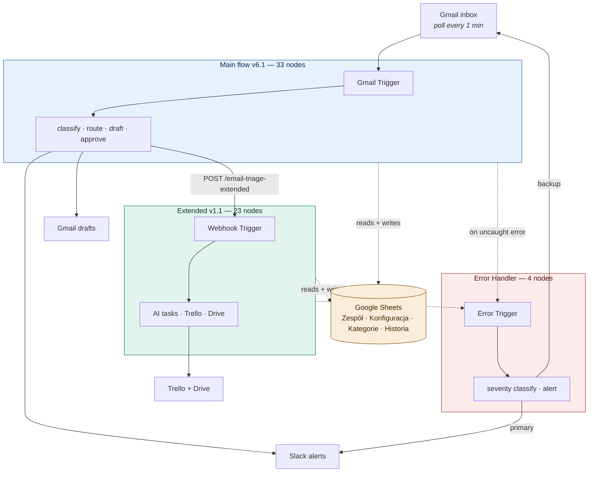

# Email Triage System


> **Featured project:** Email Triage System — `gpt-4o-mini` email classifier + auto-router + draft generator with human-in-the-loop approval. Three connected workflows (~60 functional nodes), 24/24 end-to-end tests passing, designed for non-technical operator self-service.

📖 [Business case study](https://rich-peace-f2a.notion.site/Email-Triage-System-34f9c64536fc811db728c4e27c983254?source=copy_link) · 🎬 [4-minute walkthrough on YouTube](https://www.youtube.com/watch?v=WiEwL8NJ8II) · 📋 [10 ADRs](docs/design_decisions_ADR.md)


[](https://www.youtube.com/watch?v=WiEwL8NJ8II)

> **▲ Click to watch:** 4-minute walkthrough showing the system end-to-end — Gmail trigger, AI classification, Slack notifications, approval flow, audit log.


---

## System overview

| Component | Trigger | Functional nodes | Purpose |
|---|---|---|---|
| **Main flow (v6.1)** | Gmail polling (1 min) | 33 | Read → classify → route → draft → notify → [approval] |
| **Extended (v1.1)** | Webhook from main | 23 | AI tasks → Trello + Drive + Sheets log |
| **Error Handler** | n8n Error Trigger | 4 | Severity-classified Slack + Gmail alerts |



**Stack:** n8n (self-hosted on Hostinger) · OpenAI `gpt-4o-mini` · `@langchain` Structured Output Parser · Gmail · Google Sheets · Google Drive · Trello REST API · Slack (Web API + chat:write scopes)

### Main flow data path

```
Gmail Trigger (poll 1min, unread filter)
     ↓
Load Sheets × 3 (Zespół / Konfiguracja / Kategorie)   retry 3× × 2s
     ↓
Validate Email                                         Code node
     ├── Idempotency: $getWorkflowStaticData (last 500 messageIds)
     ├── HTML strip + truncate (3000 chars from config)
     └── Throw if no sender (caught by errorWorkflow)
     ↓
AI Categorize Email                                    LangChain chain
     ├── OpenAI gpt-4o-mini (temp 0.1, max 500 tok)
     └── Structured Output Parser (JSON schema, 5 fields)
     ↓
Validate and Route                                     Code node
     ├── Parse AI output (object / markdown-fenced / raw text / direct)
     ├── Semantic fallback (unknown category → default + flag)
     ├── Keyword fallback (regex on subject+body, 9 patterns)
     ├── Assign person from Zespół[category]
     └── Set crisis manager if isUrgent
     ↓
Gmail Add Label  →  AI Generate Draft (temp 0.4)  →  Gmail Create Draft
     ↓
Format Notification ──┬── NOTIFY ──→ Slack channel + DM → Mark as Read
                      │
                      └── APPROVAL ──→ Email with 3 buttons
                                       → Wait (resume: webhook, limitWaitTime: 2 days)
                                       → Switch (zatwierdz/popraw/odrzuc/timeout)
                                       → Gmail Reply (only on approve)
                                       → GSheets Log Decision
```

---


## Defense in depth — 9 safety layers

Production email systems fail in many ways. A single point of failure between Gmail trigger and audit log can mean a lost lead, a missed legal deadline, or a frustrated client. This system layers safety mechanisms at four levels — code, node, workflow, and notification — so when any one mechanism fails, others catch the consequence.

The 9 layers are not theoretical — every one is implemented in the workflow JSON files in this repo. Below: what each layer does, why it exists, and where to find it.

### Layers grouped by level

| # | Level | Layer | Mechanism | Where in code |
|---|---|---|---|---|
| 1 | **Code** | Idempotency cache | 500-entry messageId cache in `$getWorkflowStaticData` — duplicates skipped before any side-effect | [`Validate Email`](workflows/01-email-triage-main.json) Code node — see [code pattern](#idempotency-cache-without-external-db) |
| 2 | **Code** | 4-layer AI parsing fallback | Schema → markdown parser → semantic graceful degradation → keyword classifier | [`Validate and Route`](workflows/01-email-triage-main.json) Code node — see [code pattern](#four-layer-ai-parsing-fallback) |
| 3 | **Node** | Per-service retry policies | Sheets 3×/2s, Slack 3×/3s, Slack alerts 3×/5s — differentiated by service characteristics | 6 nodes in MAIN, 2 in EXTENDED, 1 in ERROR — `retryOnFail` parameters in workflow JSON |
| 4 | **Node** | Graceful degradation on side effects | `onError: continueRegularOutput` on non-critical nodes — single failure doesn't abort downstream flow | 15 nodes in MAIN, 9 in EXTENDED, 2 in ERROR |
| 5 | **Workflow** | Mark as Read at end of flow | Email stays unread until all side effects complete — mid-flow failure → re-processed on next Gmail poll | [`Gmail - Mark as Read`](workflows/01-email-triage-main.json), after Slack/Drafts/Approval kick-off |
| 6 | **Workflow** | Wait timeout (2 days) | `limitWaitTime` on approval webhook — flow can't hang indefinitely waiting for human decision | [`Wait - Decision`](workflows/01-email-triage-main.json) |
| 7 | **Workflow** | Dedicated Error Handler workflow | `errorWorkflow` binding on MAIN and EXTENDED — any unhandled crash triggers Error Handler automatically | `settings.errorWorkflow` in both [main](workflows/01-email-triage-main.json) and [extended](workflows/02-email-triage-extended.json) |
| 8 | **Notification** | Severity classification | Regex on error message → HIGH 🔴 (ECONNREFUSED, timeout, 503) / MEDIUM 🟡 / LOW 🟠 (parse, validation, FALLBACK) | [`Format Error Alert`](workflows/03-email-triage-error-handler.json) Code node — see [code pattern](#severity-classification-in-error-workflow) |
| 9 | **Notification** | Dual-channel alerting | Slack primary + Gmail backup — Slack outage doesn't silence error notifications | [`03-email-triage-error-handler.json`](workflows/03-email-triage-error-handler.json) — Format Error Alert forks to both channels |

### What this looks like in failure scenarios

The 9 layers above describe *how* the system is defended. The table below describes *what happens* when specific components fail — which is what operators actually need to know:

| Failure scenario | Layers that catch it | Outcome |
|---|---|---|
| OpenAI API doesn't respond | #2 (4-layer fallback) → #3 (retry) → #7 (Error Handler) | Keyword fallback categorizes email; Slack notification fires with `_parseError: true` flag; admin alert via #8/#9 |
| Gmail API fails on label/draft | #4 (`onError: continueRegularOutput`) → #5 (Mark as Read) | Flow continues; email stays unread; next Gmail poll re-processes |
| Slack credentials revoked | #3 (retry 3×) → #4 (`onError`) → #9 (Gmail backup) | Draft already in Gmail; admin still gets alert via Gmail backup channel |
| Google Sheets unavailable | #3 (retry 3× with 2s delay) → #7 (Error Handler) | After 6s of retries, Error Handler triggers Slack + Gmail alerts |
| Duplicate email (Gmail re-poll, retry) | #1 (idempotency cache) | Second run returns `[]` from `Validate Email` — no Slack DM, no draft, no audit log entry |
| Empty subject / body | Code-level validation in `Validate Email` | Subject = `(brak tematu)`, body = `(brak treści)`; AI categorizes best-effort |
| Email body very long (token overflow risk) | Code-level truncation to `body_limit` (default 3000 chars) | AI gets truncated body; cost stays bounded |
| Approval timeout (nobody clicks for 2 days) | #6 (Wait limitWaitTime) | Slack timeout alert fires automatically; team knows draft needs review |
| Error Handler itself fails | #9 (dual-channel) | If Slack OAuth dies, Gmail backup still delivers alert. If both die, n8n execution log is last line |

### Why this matters

Every layer addresses a specific failure mode that occurred in development or testing — not theoretical. Layer 1 (idempotency) was added after observing duplicate Slack notifications during n8n retries. Layer 4 (`onError: continueRegularOutput`) was added after a Gmail label rate limit caused full workflow abort. Layer 9 (dual-channel) was added after a Slack OAuth refresh failed and an error went unnoticed for 6 hours.

For the architectural rationale of each decision, see [`docs/design-decisions.md`](docs/design_decisions_ADR.md).

---

## Test results

**24/24 passing** on full end-to-end pipeline (run 2026-04-08). Webhook trigger + n8n MCP `n8n_test_workflow`. Average execution: ~30s per test.

| Category | Tests | Status |
|---|---|---|
| 10 standard categories | 10 | ✅ all pass |
| Urgent flag detection | 3 | ✅ all pass |
| Edge cases (v6) | 4 | ✅ all pass |
| Edge cases (general) | 7 | ✅ all pass |

Edge cases verified:
- Empty subject / empty body
- Forwarded spam / chain mail
- Nested replies with quoted text
- Out-of-office autoresponder
- Multi-topic (scope change + workshop invitation)
- English email through Polish workflow
- Single-word "Pilne" subject
- Noreply with large HTML payload
- Subtle spam (newsletter)

Full results + per-test execution IDs: [`testy/test_results_2026-04-08.md`](testy/test_results_2026-04-08.md)

Test specification (33 cases — what each test verifies, expected outcomes, error simulation procedures): [`testy/test_cases.md`](testy/test_cases.md)

Test data + replay instructions: [`testy/test_emails.json`](testy/test_emails.json)

---


## Quick start

```bash
# 1. Clone repo
git clone https://github.com/TatianaG-ka/n8n-automation-portfolio.git
cd n8n-automation-portfolio

# 2. Read setup guide (60-90 min for full setup)
cat docs/SETUP.md

# 3. Import workflows in this order:
#    a. workflows/03-email-triage-error-handler.json   (must exist first)
#    b. workflows/01-email-triage-main.json
#    c. workflows/02-email-triage-extended.json

# 4. Configure 6 credentials in n8n UI
#    See: docs/SETUP.md#phase-6-n8n-credentials

# 5. Set up Google Sheets per docs/google-sheets-schema.md
#    4 tabs: Zespół / Konfiguracja / Kategorie / Historia

# 6. Test with pinned input data before activation
```

Full step-by-step: [`docs/SETUP.md`](docs/SETUP.md)

---

## Repository structure

```
.
├── README.md                              ← you are here
├── workflows/
│   ├── README.md                         Sanitization disclosure + placeholder reference
│   ├── 01-email-triage-main.json         33 nodes, Gmail trigger
│   ├── 02-email-triage-extended.json     24 nodes (23 functional + 1 sticky), webhook trigger
│   └── 03-email-triage-error-handler.json 5 nodes (4 functional + 1 sticky), error trigger
├── docs/
│   ├── design-decisions_ADR.md               10 ADRs in immutable format
│   ├── google-sheets-schema.md           Schema for 4 config tabs
│   ├── google-sheets-template.xlsx       Pre-filled template, importable to Google Sheets
│   ├── SETUP.md                          Step-by-step deployment
│   ├── prompts/
│   │   ├── README.md                     Prompt versioning policy
│   │   ├── categorize-v1-production.md   Active classifier prompt
│   │   ├── categorize-v2-candidate.md    Candidate with few-shot examples
│   │   ├── generate-draft-v1-production.md  Active draft prompt
│   │   ├── generate-draft-v2-candidate.md   Candidate with 4-element structure
│   │   └── ab-test-methodology.md        Test design, metrics, decision criteria
│   └── testy/
│       ├── test_cases.md                 33 test cases (executable spec)
│       ├── test_emails.json              24 test scenarios (input data)
│       └── test_results_2026-04-08.md    24/24 pass full pipeline

```
---

## Documentation index

| Document | Purpose | Audience | Status |
|---|---|---|---|
| [`README.md`](README.md) | Code reference (this file) | Developer | Live |
| [`docs/SETUP.md`](docs/SETUP.md) | Step-by-step deployment | DevOps | Live |
| [`docs/design_decisions_ADR.md`](docs/design_decisions_ADR.md) | 10 ADRs with full context | Senior reviewer | Live |
| [`docs/google-sheets-schema.md`](docs/google-sheets-schema.md) | Sheet tabs reference | Operator | Live |
| [`docs/google-sheets-template.xlsx`](docs/google-sheets-template.xlsx) | Pre-filled template, importable to Google Sheets | Operator | Live |
| [`docs/prompts/`](docs/prompts/) | Prompt versioning + A/B test methodology | AI engineer / Senior reviewer | Live |
| [`testy/test_cases.md`](testy/test_cases.md) | Test specification (33 cases) | QA / Senior reviewer | Live |
| [`testy/test_results_2026-04-08.md`](testy/test_results_2026-04-08.md) | Test execution report | QA | Live |
| [`workflows/README.md`](workflows/README.md) | Sanitization disclosure + placeholder reference | Security reviewer | Live |

---

## License

- **Workflow JSON:** MIT — adapt for your project
- **Documentation:** CC BY 4.0 — share with attribution
