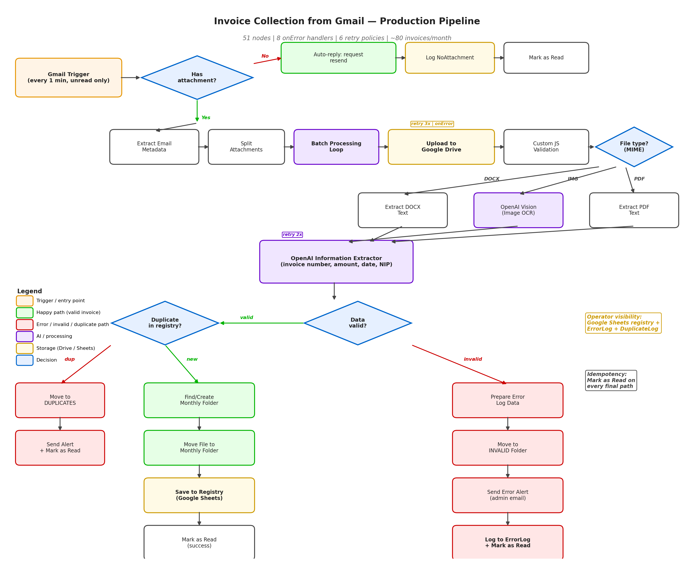
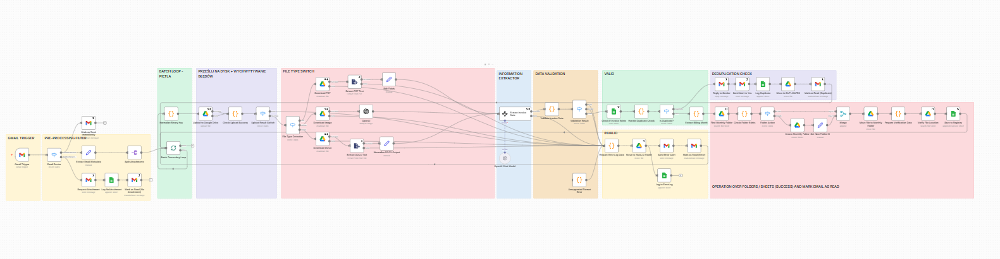
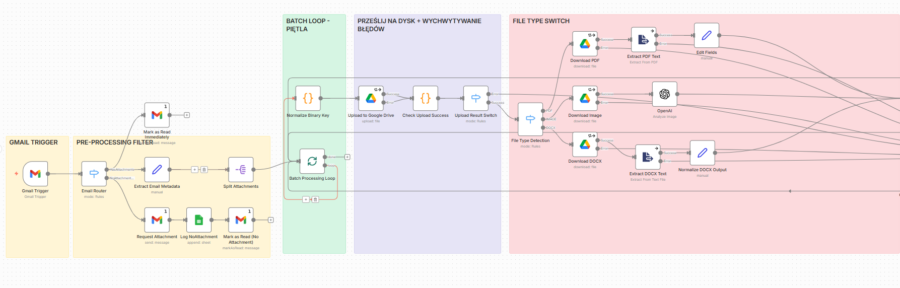
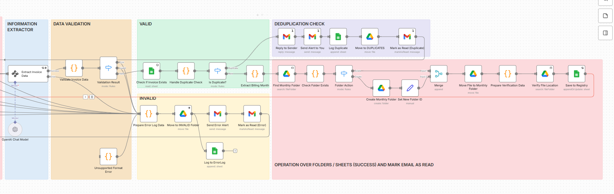

# Invoice Collection from Gmail — Production n8n Workflow

> Production-grade workflow that monitors a client's Gmail inbox, extracts invoice attachments, runs AI-based data extraction, deduplicates against a registry, and archives files in monthly Drive folders — with retry policies, error logging, and admin alerts.

📄 **[Full case study with architecture diagrams (Polish) →](https://www.notion.so/Invoice-Collection-from-Gmail-34f9c64536fc8125a4e5f4c495d6b2e6?source=copy_link)**

---

## At a glance

| | |
| --- | --- |
| **Status** | 🟢 Pilot deployment at SMB client |
| **Scale** | ~80 invoices/month |
| **Architecture** | 51 logic nodes |
| **Error handling** | 8 onError handlers · 6 retry policies |
| **Stack** | n8n · Gmail API · Google Drive · Google Sheets · OpenAI · custom JS |

---

## Problem

SMB client received dozens of invoices monthly via email in mixed formats (PDF, phone photos, DOCX). The full process — from receiving the email to archiving the file — was manual:

- ~8h/month spent on repetitive work (download → open → read → register → file)
- No duplicate detection — same invoice sent twice ended up in the registry twice
- Invoices got lost in the inbox with no "processed" tracking
- Archive was a single folder with no monthly structure

Goal: take this end-to-end, from inbox to archived file, with zero manual touch on the happy path.

---

## Solution

n8n workflow that polls Gmail every 30 minutes, routes attachments by MIME type, extracts invoice data via OpenAI, validates and deduplicates against a Google Sheets registry, then archives files in monthly Drive folders.

### Architecture

---

### Key technical decisions

- **Gmail labels as workflow state.** Processed / error / duplicate emails are flagged via Gmail labels and `Mark as Read`, so the operator can audit state directly in the Gmail UI rather than digging through n8n execution logs.
- **Self-loop prevention via subject filter.** The Gmail Trigger excludes emails flagged with error emoji (`-subject:"❌" -subject:"⚠️"`) to prevent the workflow from re-processing its own error notifications.
- **Attachment array flattening.** A `Split Out` node handles emails with multiple invoices — one email with 5 PDFs becomes 5 independent processing streams, each preserving original message metadata (Message ID, Sender).
- **Retry policy on external APIs.** Drive uploads use `Retry on Fail` (max 3 attempts, 5000ms interval). OpenAI extraction uses retry 2x. Prevents flow failure on transient API issues.
- **Custom JS validation node.** A JavaScript Code node verifies API responses — if Drive returns no file ID, the script generates a structured error object (filename, message ID, timestamp) for clean logging downstream.
- **Type sniffing in the orchestrator, not the extractor.** MIME-based routing happens in n8n via Switch node, so PDF/image/DOCX go to dedicated extraction paths. Keeps each branch focused on one format.
- **Operator-friendly registry.** All state (invoice registry, error log, duplicate log) lives in Google Sheets — the non-technical operator (the client's accountant) can read everything without touching n8n.

### Error handling & monitoring

- **8 onError paths** — every critical step has a defined fallback route
- **6 retry policies** — automatic retry on transient API failures
- **ErrorLog sheet** — every failure logged with timestamp, stage, and details
- **Email alerts** to admin on critical errors
- **Mark as Read on every path** — no email is processed twice (idempotency)

---

## Results

| Metric | Before | After |
| --- | --- | --- |
| Manual handling time | ~8h/month | <30min/month (monitoring & exceptions only) |
| Invoice tracking | No registry → no audit trail | Every invoice in registry or error log |
| Duplicate detection | None (same invoice could enter registry multiple times) | Automatic detection + separate handling |
| Email-to-archive latency | 1–3 days | <2 minutes |
| Operator visibility | Manual | Full transparency via Google Sheets (registry + error log + duplicate log) |

---

## Known limitations & next iteration

Built into the roadmap, not gaps in awareness:

- **AI output validation is currently structural** (field completeness). Next iteration: NIP checksum validation, sanity checks (amount > 0, date not in future, gross = net + VAT ±0.01), confidence threshold for human-in-the-loop on low-confidence extractions.
- **OCR for image attachments** uses OpenAI vision — works for clean phone photos but degrades on poor lighting/skew. Considering Tesseract pre-pass as fallback.
- **Scale ceiling.** Architecture is comfortable at current scale (~80 invoices/month). At >1000/month I'd add batch processing and a local OCR pre-filter for simple cases to reduce OpenAI cost.

---

## Tech stack

| Layer | Technology |
| --- | --- |
| Orchestration | n8n |
| Email trigger | Gmail OAuth (poll every 30 minutes) |
| Routing | n8n Switch nodes (MIME type), IF nodes (validation/dedup) |
| AI extraction | OpenAI (Information Extractor, vision for images) |
| Storage | Google Drive (file archive), Google Sheets (registry + logs) |
| Custom logic | JavaScript Code nodes (validation, error object generation) |
| Notifications | Email (admin alerts), Gmail labels (operator-facing state) |

---

## What this project demonstrates

- **Production-grade n8n architecture** — retry policies, error handling, idempotency, audit trails
- **Hybrid orchestration** — low-code n8n + custom JS where native nodes don't suffice
- **OAuth integration with third-party APIs** in a production setting (Gmail, Drive, Sheets)
- **Multi-format document routing** with format-specific extraction paths
- **Operator-aware design** — state visible to non-technical users in tools they already know (Gmail UI, Google Sheets)
- **In-canvas documentation** — sticky notes with deployment checklist and test scenarios, so the system stays maintainable

---

## Code & workflow

> Workflow JSON is not public due to client NDA. 

📄 **[Full case study with architecture diagrams (Polish) →](https://rich-peace-f2a.notion.site/Invoice-Collection-from-Gmail-34f9c64536fc8125a4e5f4c495d6b2e6?source=copy_link)**

---

**Author:** [Tatiana Golińska](https://github.com/TatianaG-ka/) · 📧 [LinkedIn](https://www.linkedin.com/in/tetiana-golinska/)
